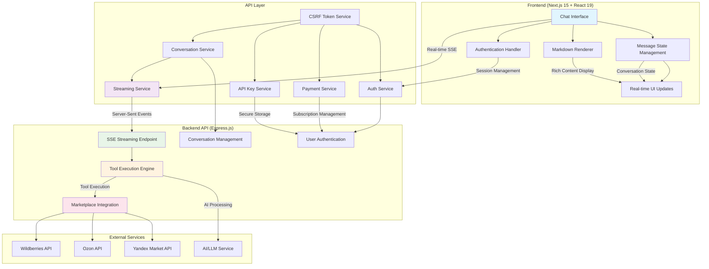

# MP Bot - AI Chatbot Platform Technical Showcase

## 1. PROJECT OVERVIEW

**MP Bot** is a sophisticated AI-powered chatbot platform designed for e-commerce marketplace optimization, specifically targeting Wildberries business analytics. The application provides real-time conversational AI with advanced tool execution capabilities, allowing users to interact with their marketplace data through natural language conversations.

**Technology Stack:** Next.js 15, React 19, TypeScript, Express.js, Tailwind CSS, Shadcn/ui, Server-Sent Events (SSE)

## 2. KEY FEATURES & INTEGRATIONS

### Core Features
- **Real-time streaming conversations** with Server-Sent Events (SSE) implementation
- **AI agent with tool execution framework** supporting complex multi-step operations
- **Conversation persistence and management** with session handling
- **Advanced markdown rendering** with interactive tables and code syntax highlighting
- **Responsive mobile-first design** optimized for cross-device usage
- **Demo mode** for unauthenticated users

### Integrations (HIGHLIGHT SECTION)
- **Custom Backend API** - Express.js REST API with comprehensive conversation management
- **Marketplace APIs Integration** - Wildberries, Ozon, Yandex Market API connections
- **Authentication System** - Custom session-based auth with CSRF protection
- **Payment Processing** - Subscription-based payment system with tiered pricing plans
- **Metrics & Analytics API** - Real-time business intelligence data fetching
- **API Key Management** - Secure credential storage for marketplace services
- **Tool Execution Engine** - Dynamic AI agent capabilities with real-time feedback

## 3. TECHNICAL HIGHLIGHTS

### Architecture
- **Frontend-Backend Communication:** RESTful API with real-time SSE streaming
- **Real-time Messaging:** Custom SSE implementation with chunk-based content delivery
- **Data Flow:** React state management → API services → Backend streaming → Real-time UI updates

### Impressive Technical Solutions

#### 1. Advanced Streaming Implementation
- **Challenge:** Implementing real-time AI response streaming with tool execution support
- **Solution:** Built custom SSE (Server-Sent Events) system with event-based architecture supporting conversation chunks, tool execution events, and error handling
- **Technologies:** Custom SSE parser, AbortController for cancellation, TypeScript event types
- **Impact:** Provides ChatGPT-like real-time response experience with ability to stop generation mid-stream

#### 2. Tool Execution Framework
- **Challenge:** Enabling AI agents to execute external tools while maintaining conversation flow
- **Solution:** Implemented event-driven tool execution system with real-time status updates and seamless conversation continuation
- **Technologies:** Custom event system, tool state management, asynchronous operation handling
- **Impact:** Allows AI to perform complex marketplace operations (data analysis, API calls) while keeping users informed in real-time

#### 3. Comprehensive Authentication & Security
- **Challenge:** Securing API access while maintaining smooth user experience
- **Solution:** Custom CSRF token system with automatic refresh, session management, and graceful error handling
- **Technologies:** CSRF token caching, HTTP-only cookies, custom auth middleware
- **Impact:** Enterprise-grade security without compromising user experience

#### 4. Advanced Message Rendering System
- **Challenge:** Rendering complex AI responses including markdown, tables, and interactive content
- **Solution:** Built custom markdown renderer with collapsible tables, syntax highlighting, and responsive design
- **Technologies:** react-markdown, remark-gfm, custom React components, Tailwind CSS
- **Impact:** Professional-grade message presentation supporting complex data visualization

## 4. TECHNOLOGY STACK

### Frontend
- **Framework:** Next.js 15.3.2 with React 19.0.0
- **Language:** TypeScript 5
- **UI Library:** Shadcn/ui with Radix UI primitives
- **Styling:** Tailwind CSS 4 with custom components
- **State Management:** React Hooks (useState, useEffect)
- **Routing:** Next.js App Router with dynamic routes

### Backend Integration
- **API:** Express.js REST API (localhost:3001)
- **Communication:** Fetch API with credential-based authentication
- **Real-time:** Server-Sent Events (SSE) streaming
- **Error Handling:** Custom ApiError classes with status codes

## 5. DEVELOPMENT & DEPLOYMENT

- **Build Process:** Next.js production build with TypeScript compilation
- **Environment:** Development server with hot reloading
- **Performance:** Code splitting, lazy loading, responsive image optimization
- **Security:** CSRF protection, secure cookie handling, input validation
- **Code Quality:** ESLint configuration, TypeScript strict mode

## 6. STANDOUT TECHNICAL ACHIEVEMENTS

### Real-time Conversation Management
- Implemented sophisticated message state management with pending, success, and error states
- Built conversation persistence with automatic URL updating
- Created seamless conversation switching with state preservation

### Advanced UI/UX Features
- **Typing Indicators:** Dynamic "thinking" messages during AI processing
- **Abort Functionality:** Real-time generation cancellation with graceful cleanup
- **Responsive Design:** Mobile-optimized chat interface with adaptive layouts
- **Accessibility:** ARIA labels, keyboard navigation, screen reader support

### Robust Error Handling
- Comprehensive error boundary implementation
- Graceful degradation for network failures
- User-friendly error messages with retry mechanisms
- Authentication state management with automatic dialog prompts

### Performance Optimizations
- Lazy loading of conversation components
- Optimized markdown rendering with table virtualization
- Efficient state updates with React best practices
- Memory management for large conversations

## 7. MEDIA PLACEHOLDERS

- **DEMO_VIDEO_PLACEHOLDER**: Real-time streaming conversation with tool execution demo
- **ARCHITECTURE_DIAGRAM_PLACEHOLDER**: SSE streaming architecture with tool execution flow
- **CHAT_INTERFACE_SCREENSHOT**: Clean, responsive chat interface showing markdown rendering
- **INTEGRATION_FLOW_DIAGRAM**: Marketplace API integration and authentication flow
- **TOOL_EXECUTION_SCREENSHOT**: AI agent performing complex operations with real-time feedback
- **MOBILE_RESPONSIVE_SCREENSHOTS**: Mobile chat experience across different screen sizes
- **ADMIN_PANEL_SCREENSHOT**: User dashboard with conversation management and API key configuration

## 8. BUSINESS VALUE & SCALABILITY

This chatbot platform demonstrates enterprise-ready architecture with:
- **Scalable Architecture:** Modular service design ready for horizontal scaling
- **Extensible Tool System:** Easy addition of new AI capabilities and integrations
- **Multi-tenant Ready:** User isolation and resource management built-in
- **Production Security:** Industry-standard authentication and data protection
- **Performance Optimized:** Sub-second response times with efficient state management

The technical implementation showcases advanced full-stack development skills, real-time system design, and modern web application architecture suitable for production deployment. 